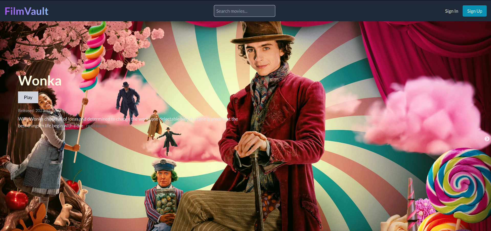

# FilmVault

FilmVault is a web application that allows users to explore a vast collection of movies, add favorites to their personal list, and seamlessly search for and watch their favorite films. The project is built using Laravel for the backend and React for the frontend, providing a modern and efficient user experience.

## Features

- **Browse Movies:** Explore a diverse catalog of movies with details such as title, release year, genre, and more.

- **Search Functionality:** Easily find specific movies using the powerful search feature.

- **Add to Favorites:** Create a personalized list of favorite movies for quick access.

- **Watch Movies:** Seamlessly watch your selected movies directly on the platform.

## Technologies Used

- **Laravel (Backend):** A PHP web application framework that provides a robust backend structure for handling data and business logic.

- **React (Frontend):** A JavaScript library for building user interfaces, offering a responsive and dynamic frontend experience.

- **Database:** MySQL.

## Getting Started

Follow these steps to set up and run FilmVault locally:

1. Clone the repository:

   ```bash
   git clone https://github.com/your-username/filmvault.git
   ```

2. Navigate to the project directory:

   ```bash
   cd filmvault
   ```

3. Install backend dependencies:

   ```bash
   composer install
   ```

4. Set up the database:

   ```bash
   php artisan migrate
   ```

5. Install frontend dependencies:

   ```bash
   npm install
   ```

6. Build the frontend assets:

   ```bash
   npm start
   ```

7. Start the development server:

   ```bash
   php artisan serve
   ```

   The application will be accessible at `http://localhost:8000`.


## License

This project is licensed under the [MIT License](LICENSE.md).

## Acknowledgments

- Special thanks to [MEGANE](https://github.com/megane0103) for their invaluable contributions and support throughout the development of FilmVault.

## Contact

For any inquiries, please contact [defaltastra@gmail.com](mailto:defaltastra@gmail.com).

Happy movie watching with FilmVault! 🍿🎬
